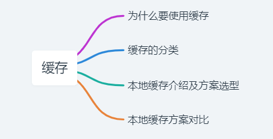
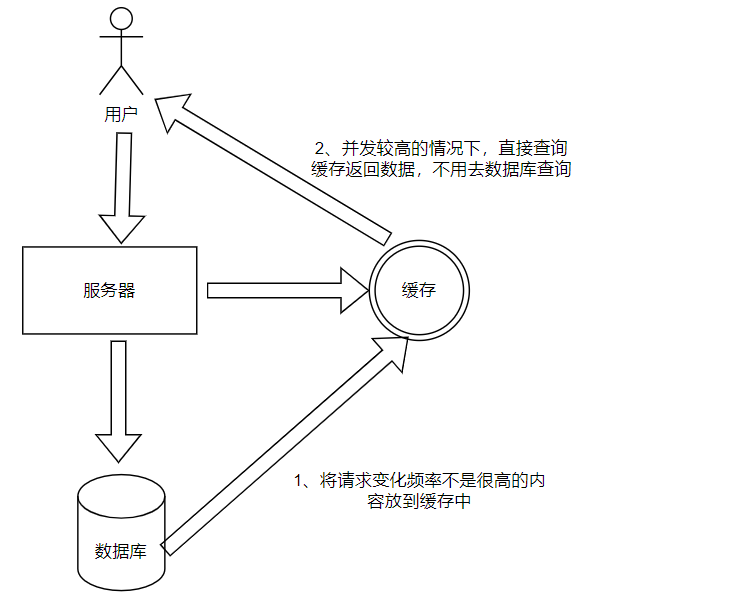

# 缓存之王-上



# 前言

在业务中出现流量高峰的场景下，例如电商秒杀，APP活动首页访问。对于MySql 等传统的关系型数据库已经不足以支撑，很容易造成数据库的宕机，随着缓存技术的出现很好的解决了这个问题。**缓存**是计算机系统中必不可少的一种解决性能问题的方法，常见的应用包括CPU缓存、操作系统缓存、本地缓存、分布式缓存、HTTP缓存、数据库缓存等。其**核心就是用空间换时间**，通过分配一块高速存储区域（一般来说是内存）来提高数据的读写效率。

# 为什么要使用缓存

在前面的介绍中，其实能明确缓存能起到的作用了。由于是存储在内存中，数据的读取会跳过部分直接从磁盘读取的步骤，在大量减少对数据库访问压力的情况下，保证应用的并发量和性能。所以缓存能给我们系统带来的好处就是**高性能**和**高并发。**

- **高性能**：在一些读请求变化频率不是很高的情况下，将结果放在缓存中省略磁盘读取的步骤，可以很直接的对应用性能带来提升。
- **高并发**：类似 mysql 的关系性数据库，对于并发的支持并没有那么友好，单机 2000 QPS已经不错了。但是对于 redis 之类的缓存来说， 功能简单，说白了就是 key-value 操作，单机的支撑量可以很轻松的达到几万到10几万，缓存是走内存的，内存天然就支持高并发。



# 缓存的分类

缓存基本上可以分为三类：本地缓存、分布式缓存、多级缓存

根据缓存和应用程序是否属于同一个进程，将缓存分为**本地缓存**和**分布式缓存。**基于本地缓存和分布式缓存都有各自的优点和缺点，后面又出现了**多级缓存**的概念。

- **本地缓存：**是指和应用程序在同一个进程内的内存空间去存储数据，数据的读写都是在同一个进程内完成的。
- **分布式缓存：**分布式缓存是独立部署的服务进程，并且和应用程序没有部署在同一台服务器上，所以是需要通过远程网络请求来完成分布式缓存的读写操作，并且分布式缓存主要应用在应用程序集群部署的环境下。
- **多级缓存：**基于本地缓存和分布式缓存的优缺点，多级缓存应运而生，在实际的业务开发中一般也是采用多级缓存。**本地缓存一般存储更新频率低，访问频率高数据，分布式缓存一般存储更新频率较高的数据。**所以在业务开发中，我们通常使用本地缓存作为一级缓存，分布式缓存作为二级缓存。

# 本地缓存介绍及方案选型

本文先介绍对于本地缓存的使用及Java中的一些实现。分布式缓存和多级缓存会涉及到更多并发的问题和缓存一致性的问题，我们后续文章讨论。

Java的本地缓存很早就有了相关的标准**`javax.cache` ，**要求的特性包括原子操作、缓存读写、缓存事件监听器、数据统计内容等。实际在工作中本地缓存主要用于**特别频繁访问的稳定数据**，不然带来的数据不一致会得不偿失。

基于已有的规范，也出现了比较优秀的缓存实现方式，包括比较常用的**Guava Cache、Caffeine和Encache。**

## **ConcurrentHashMap 实现本地缓存**

缓存的本质就是存储在内存中的 KV 数据结构，所以最简单的缓存对应的就是 jdk 中线程安全的ConcurrentHashMap，但是要实现缓存，还需要考虑淘汰、最大限制、缓存过期时间淘汰等等功能。

**优点：**实现简单，不需要引入第三方包，比较适合一些简单的业务场景。缺点是如果需要更多的特性，需要定制化开发，成本会比较高，并且稳定性和可靠性也难以保障。对于比较复杂的场景，建议使用比较稳定的开源工具。

## **Guava Cache 实现本地缓存**

Guava是Google团队开源的一款 Java 核心增强库，包含集合、并发原语、缓存、IO、反射等工具箱，性能和稳定性上都有保障，应用十分广泛。其缓存创建方式包括`cacheLoader`和`callable callback`两种，前者针对整个`cache`，而后者比较灵活可以在`get`时指定。Guava Cache支持很多特性，例如：

- 支持最大容量限制：maximumSize(long)
- 支持两种过期删除策略:
    
    > expireAfterAccess(long, TimeUnit)：在这个时间段内没有被读/写访问，就会被回收。
    > 
    
    > expireAfterWrite(long, TimeUnit)：在这个时间段内没有被写访问，就会被回收 。
    > 
- 支持简单的统计功能
- 基于LRU算法实现
- 监听事件：removalListener(RemovalListener)

下面是一个简单的使用示例：

```java
@Slf4j
@Service
public class CacheServiceImpl implements CacheService {
    Cache<String, String> cache = CacheBuilder.newBuilder()
            .initialCapacity(5)  // 初始容量
            .maximumSize(10)     // 最大缓存数，超出淘汰
            .expireAfterWrite(60, TimeUnit.SECONDS) // 过期时间
            .build();
		@Override
    public  void tCache() throws ExecutionException {
        String orderId = String.valueOf(123456789);
        // 获取orderInfo，如果key不存在，callable中调用getInfo方法返回数据
        String orderInfo = cache.get(orderId, () -> getInfo(orderId));
        log.info("orderInfo = {}", orderInfo);
    }
    private static String getInfo(String orderId) {
        String info = "bb";
        // 当redis缓存不存在查db
        log.info("get data from mysql");
        info = String.format("{orderId=%s}", info);
        log.info("获取的值为:"+info);
        return info;
    }

}
```

## **Caffeine实现本地缓存**

Caffeine 是基于 java8 实现的新一代缓存工具，缓存性能接近理论最优，可以看作是**Guava Cache的增强版**，功能上两者类似，不同的是Caffeine采用了一种结合 LRU、LFU 优点的算法：W-TinyLFU，在性能上有明显的优越性。

简单的使用示例：

```java
//应用依赖如下
dependencies {
    implementation'com.github.ben-manes.caffeine:caffeine:2.8.4'
}
```

测试代码如下：

```java
@Slf4j
@Service
public class CaffeineServiceTestImpl implements CaffeineServiceTest {
    Cache<String, String> cache = Caffeine.newBuilder()
            .initialCapacity(5)
            // 超出时淘汰
            .maximumSize(10)
            //设置写缓存后n秒钟过期
            .expireAfterWrite(60, TimeUnit.SECONDS)
            //设置读写缓存后n秒钟过期,实际很少用到,类似于expireAfterWrite
            //.expireAfterAccess(17, TimeUnit.SECONDS)
            .build();
		@Override
    public  void tCache(){
        String orderId = String.valueOf(123456789);
        // 获取orderInfo，如果key不存在，callable中调用getInfo方法返回数据
        String orderInfo = cache.get(orderId, key -> getInfo(orderId));
        log.info("orderInfo = {}", orderInfo);
    }
    private static String getInfo(String orderId) {
        String info = "bb";
        // 当redis缓存不存在查db
        log.info("get data from mysql");
        info = String.format("{orderId=%s}", info);
        log.info("获取的值为:"+info);
        return info;
    }
}
```

## Encache 实现本地缓存

Encache 也是一个纯Java的进程内缓存框架，而且是Hibernate中默认的CacheProvider。同 Caffeine 和 Guava Cache 相比，Encache 的功能更加丰富，扩展性更强：

- 支持多种缓存淘汰算法，包括 LRU、LFU和FIFO
- 缓存支持堆内存储、堆外存储、磁盘存储（支持持久化）三种
- 支持多种集群方案，解决数据共享问题

简单的使用示例：

```java
//引入依赖如下
dependencies {
    implementation'org.ehcache:ehcache:3.9.7'
}
```

测试代码如下：

```java
@Service
@Slf4j
public class EhcacheServiceImpl implements CacheService {

private static final String ORDER_CACHE = "orderCache";
    CacheManager cacheManager = CacheManagerBuilder.newCacheManagerBuilder()
            // 创建cache实例
            .withCache(ORDER_CACHE, CacheConfigurationBuilder
                    // 声明一个容量为20的堆内缓存
                    .newCacheConfigurationBuilder(String.class, String.class, ResourcePoolsBuilder.heap(20)))
            .build(true);
    // 获取cache实例
    Cache<String, String> cache = cacheManager.getCache(ORDER_CACHE, String.class, String.class);
    @Override
    public  void tCache(){
        String orderId = String.valueOf(123456789);
        // 获取orderInfo，如果key不存在，callable中调用getInfo方法返回数据
        String orderInfo = cache.get(orderId);
        if (StringUtils.isBlank(orderInfo)) {
            orderInfo = getInfo(orderId);
            cache.put(orderId, orderInfo);
        }
        log.info("orderInfo = {}", orderInfo);
    }
    private static String getInfo(String orderId) {
        String info = "bb";
        // 当redis缓存不存在查db
        log.info("get data from mysql");
        info = String.format("{orderId=%s}", info);
        log.info("获取的值为:"+info);
        return info;
    }
}
```

# 本地缓存方案对比

- Guava Cache 易用性强，并且已有十分成熟的接入方案，使用简单
- Caffeine 功能与 Guava Cache 类似，但是过期算法有部分优化，性能非常优秀
- Encache 功能比较丰富，提供了持久化和集群的功能，但是这些功能对于其他分布式缓存框架优势比较有限、

上面的代码样例都非常简单的形式体现，主要是为了方便理解。对于真正的使用中**`Spring Cache`** 规范提供了非常方便的注解使用方式，真实开发过程也大部分使用注解形式。这部分内容后面会以 Java 缓存规范文章内容系统性的解释。

# 总结

本文主要介绍了：

- 什么是缓存。对于开发过程中，我们为什么会使用到缓存，缓存可以为我们的系统带来什么好处。
- 常见的 Java 缓存框架介绍：Guava Cache 、Caffeine和Encache 基本使用方式。
- 本地缓存框架的优劣对比，介绍在开发过程中，我们会正确使用本地缓存的方式。

当然，我们也有说到分布式缓存和多级缓存。这需要我们更多的中心在分布式情况下的一些缓存框架的高可用问题以及缓存一致性的问题。后面文章也会逐步展开介绍。

[JAVA缓存规范 —— 虽迟但到的JCache API与天生不俗的Spring Cache-腾讯云开发者社区-腾讯云 (tencent.com)](https://cloud.tencent.com/developer/article/2176479)

[Java缓存深入理解-腾讯云开发者社区-腾讯云 (tencent.com)](https://cloud.tencent.com/developer/article/1028722)

[Java实现本地缓存、分布式缓存及多级缓存_java 缓存-CSDN博客](https://blog.csdn.net/xiaocui1995/article/details/127043464)

[SpringBoot项目中使用缓存Cache的正确姿势！！! - 掘金 (juejin.cn)](https://juejin.cn/post/7220292698854752313)

[springboot集成本地缓存Caffeine的三种使用方式_springboot mybatis cache caffeine 运用-CSDN博客](https://blog.csdn.net/qq_41921994/article/details/109313445)