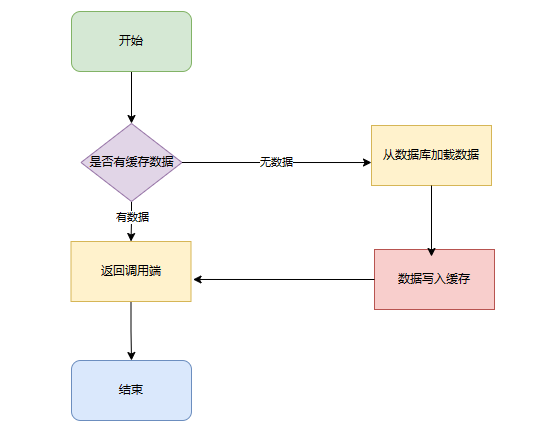
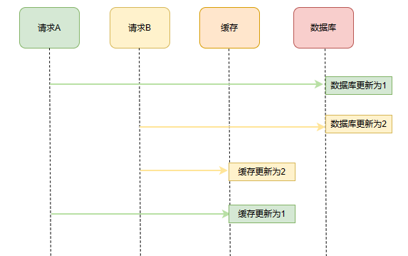
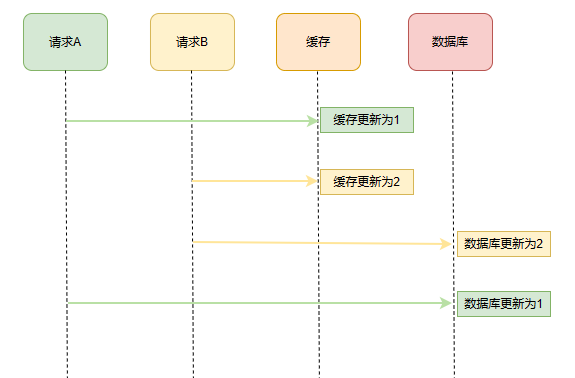
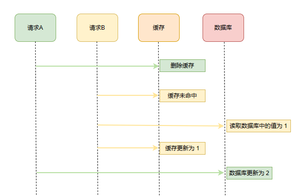
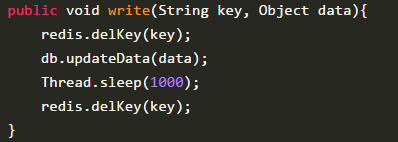
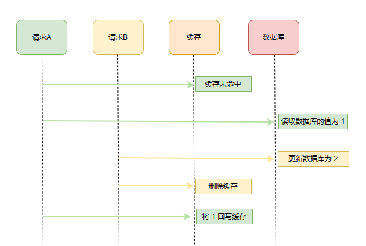
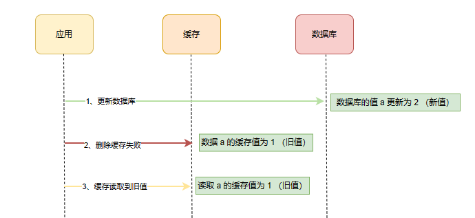
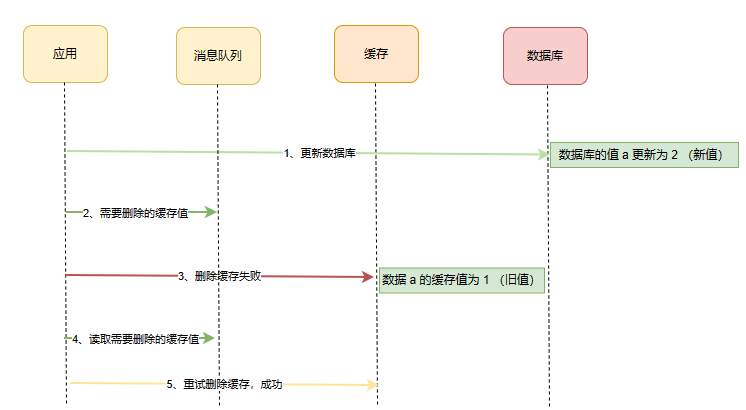
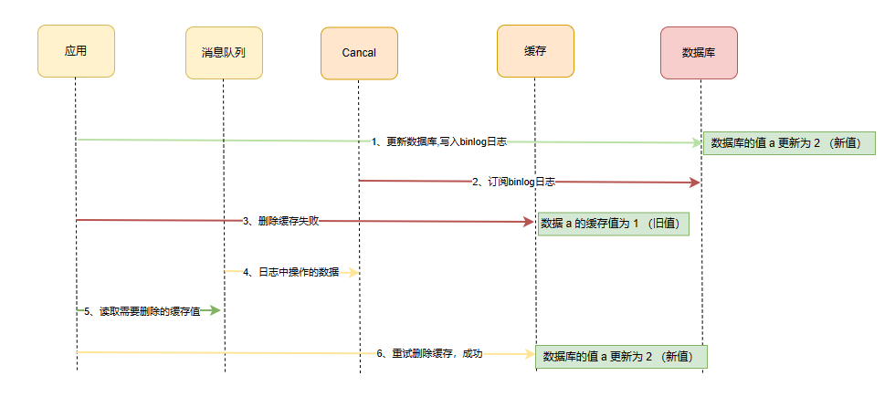

# 缓存之王-下

# 前言

在前面**`缓存之王上篇`**中，已经对于本地缓存的选型及优缺点做了分析， 但是随着互联网的快速发展，分布式系统已经成为了解决大规模并发请求、高可用性、高扩展性等问题的重要手段。所以合理的设计分布式缓存策略以及使用多级缓存来提高并发瓶颈对于系统整体的性能提升也具有重要的意义。

# 为什么要使用分布式缓存

分布式缓存同本地缓存一样本质也是通过将数据存储在内存中，加快数据访问速度，避免频繁访问数据库，提高应用的并发量和性能。但是本地缓存由于最早的单机机器的内存资源以及承载能力有限，如果大量使用本地缓存，也会使相同的数据被不同的节点存储多份，对内存资源造成较大的浪费，因此，才催生出了分布式缓存。所以分布式缓存的使用场景及定义就清晰了：**分布式缓存是独立部署的服务进程，并且和应用程序没有部署在同一台服务器上，是需要通过远程网络请求来完成分布式缓存的读写操作，并且分布式缓存主要使用在应用程序集群部署的环境下。**

# **常见的分布式缓存系统简介及选型**

常见的分布式缓存系统包括：

- Redis：内存存储的开源缓存系统，支持丰富的数据结构和持久化功能。
- Memcached：内存对象缓存系统，简单高效，适用于分布式环境。
- Hazelcast：开源的内存数据网格系统，提供分布式数据存储和计算能力。
- Apache Ignite：基于内存和磁盘的分布式数据库和计算平台，支持SQL查询和事务处理。

其实对于企业选型而言，更多还是应该看业务使用场景。假若业务场景需要用到持久化缓存功能、或者支持多种数据结构的缓存功能，那么 Redis 则是最佳选择。这也是大部分企业的分布式缓存选择。如果大家感兴趣的话，后续会针对性的对于各种选型做更细致的分析。

# **分布式缓存问题和挑战**

对于使用分布式缓存系统来设计一个好用的缓存架构方案需要考虑到多个方面，除了可用性、扩展性、性能及成本以外，还需要关注的一个问题就是 **数据一致性。**由于数据库和缓存是两个不同的数据源，要保证其数据的一致性是我们需要考虑的重点。在此过程中，我们的数据一致性通常通过事务处理、锁机制等手段来保证。在本地缓存中，除了用 concurrentHashMap 这种线程安全的方式来处理外（本质上还是锁机制），Caffeine 中也有 refreshAfterWrite 来保证最终一致性的方式。以这些作为参考，本文主要讨论分布式缓存一致性的处理。

## 缓存的查询

先查询缓存，如果查询失败，那么去查询DB，之后重建缓存，基本上不存在异议。

## 缓存的更新

从理论上来说，给缓存设置过期时间，是**保证最终一致性**的解决方案，这也是分布式事务中**柔性事务**的解决方向。这种方案下，我们可以对存入缓存的数据设置过期时间，所有的写操作以数据库为准，对缓存操作只是尽最大努力即可。也就是说如果数据库写成功，缓存更新失败，那么只要到达过期时间，则后面的读请求自然会从数据库中读取新值然后回填缓存。因此，这里讨论的思路不依赖最终一致性的方案，主要讨论主流更新策略中的优缺点：

- 先更新数据库再更新缓存
- 先更新缓存再更新数据库
- 先删除缓存再更新数据库
- 先更新数据库再删除缓存

## 1、先更新数据库再更新缓存

这套方案再并发场景下，是很容易出现问题的，如果有 AB 两个线程。执行顺序如下：

1. 线程A更新了数据库；
2. 线程B更新了数据库；
3. 线程B更新了缓存；
4. 线程A更新了缓存；

这就出现请求 A 更新缓存应该比请求 B 更新缓存早才对，但是因为网络等原因，B 却比 A 更早更新了缓存。这就导致了脏数据，**数据库中是线程 B 的新值，缓存中是线程 A 的旧值**，并且会一直这么脏下去直到缓存失效（如果设置了过期时间的话）

## 2、先更新缓存再更新数据库

执行顺序如下：

与前面的一种情况相反，但也同样会导致脏数据一直存在。**缓存中是线程 B 的新值，而数据中是线程 A 的旧值**。

这两种方式之所以会在并发场景下出现异常，**本质上是因为更新缓存和更新数据库是两个操作**，这两个操作的先后顺序在并发情况下我们无法控制。 

## 3、先删除缓存再更新数据库

还是考虑到并发情况下的特殊场景，AB 两个请求，请求 A 进行更新操作，请求 B 进行查询操作，执行顺序如下：

1. 请求A进行写操作，删除缓存；
2. 请求B查询发现缓存不存在；
3. 请求B去数据库查询得到旧值；
4. 请求B将旧值写入缓存；
5. 请求A将新值写入数据库；

上述情况就会导致不一致的情形出现。而且，如果不采用给缓存设置过期时间策略，该数据永远都是脏数据。很显然，这种情况不能解决我们的问题。

那么，如何解决呢？采用**延时双删**策略！伪代码如下：

这是基于这种方案，拓展出的延时双删解决手段。

1. 先删除缓存
2. 更新数据库（前两步一样）
3. **睡眠一段时间，**再次删除缓存

加了个睡眠时间，主要是为了确保请求 A 在睡眠的时候，请求 B 能够在这这一段时间完成「从数据库读取数据，再把缺失的缓存写入缓存」的操作，然后请求 A 睡眠完，再删除缓存。这么做，可以将这一秒内所造成的缓存脏数据再次删除。

**但是！**请求 A 的睡眠时间就必需大于请求 B 「从数据库读取数据 + 写入缓存」的时间。具体该睡眠多久无法确定，很难评估，睡眠也会影响到系统的吞吐量，还需要更进一步考虑异步删除的情况。而且针对读写分离的架构情况下，还需要考虑到主从同步的时间。所以这个方案也只是尽可能保证一致性而已，极端情况下，依然也会出现缓存不一致的现象。

## **4、先更新数据库再删除缓存（cache aside）**

很明显，这个时候大家已经能举三反一思考到并发场景下的特殊情况了，还是 AB 请求，执行顺序如下：

1. 缓存刚好失效；
2. 请求A查询数据库，得一个旧值；
3. 请求B将新值写入数据库；
4. 请求B删除缓存；
5. 请求A将查到的旧值写入缓存；

ok，如果发生上述情况，确实是发生了脏数据。

**但是！**还是有但是。上面的这种情况理论上会出现，不过，这种情况需要发生在**读缓存时缓存正好失效，而且并发着有一个写操作，**而实际上**数据库的写操作会比读操作更耗时**，而且还要锁表。情况发生必须要在写操作前进入数据库操作，而又晚于写操作更新缓存。所有这些条件都具备的概率会很小。

这种方案相对于前几种来说会更好一点，该方案也正是缓存使用的标准的 `**design pattern**`，也就是`**cache aside**`。包括 Facebook 的论文《Scaling Memcache at Facebook》也使用了这个策略。所以，要么通过 2PC 或是 Paxos 协议保证一致性，要么就是拼命的降低并发时脏数据的概率，而 Facebook 使用了这个降低概率的玩法，因为 2PC 太慢，而Paxos 太复杂。当然，最好还是为缓存设置上过期时间，这样，即使数据出现了不一致，也能在一段时间之后失效，更新上一致的数据。

## 5、其他问题

上面我们已经考虑到了各种的特殊情况，但实际上还是比较理想的情况，每种情况的操作都是连贯的，对数据库和缓存的操作都可以成功。然而在实际生产中，由于网络抖动、服务下线等等原因，操作是有可能失败的。

以**先更新数据库再删除缓存**流程为例：

删除缓存失败后，在下一次更新数据库之前，获取到的值都是缓存中的旧值。所以不管是先操作数据库，还是先操作缓存，只要第二个操作失败都会出现数据一致的问题。

问题的关键就是找到关键的问题，所以该怎么解决呢？常用的有两种方法：

- 引入可保障的重试机制
- 订阅数据库 binlog ，再操作缓存

## 5.1、可保障的重试机制

我们可以引入**消息队列**，将第二个操作（删除缓存）要操作的数据加入到消息队列，由消费者来操作数据。

- 如果应用**删除缓存失败**，可以从消息队列中重新读取数据，然后再次删除缓存，这个就是**重试机制**。当然，如果重试超过一定次数，还是没有成功，我们就需要向业务层发送报错信息了。
- 如果**删除缓存成功**，就要把数据从消息队列中移除，避免重复操作，否则就继续重试。

举个例子，来说明重试机制的过程：

这种方案是实时性中最好的方案，在重试一定次数还未成功需要业务报警出来。但是这种情况有一个缺点，就是对**发送需要删除的缓存值**这一步对业务代码有一定的侵入，于是有了订阅日志的方案。

## 5.2、订阅数据库 binlog

「**先更新数据库，再删缓存**」的策略的第一步是更新数据库，那么更新数据库成功，就会产生一条变更日志，记录在 binlog 里。

于是我们就可以通过订阅 binlog 日志，拿到具体要操作的数据，并且将这部分数据放到队列，然后再执行缓存删除，阿里巴巴开源的 Canal 中间件就是基于这个实现的。

Canal 模拟 MySQL 主从复制的交互协议，把自己伪装成一个 MySQL 的从节点，向 MySQL 主节点发送 dump 请求，MySQL 收到请求后，就会开始推送 Binlog 给 Canal，Canal 解析 Binlog 字节流之后，转换为便于读取的结构化数据，供下游程序订阅使用。

这个方案，会保证数据库和缓存的最终一致性。虽然看上起链路进一步变长了，但在这个过程中，步骤2、4、5、6和步骤1、3 已经解耦开，可以采用**异步的操作**来进行处理。

# 总结

上面的几种方案其实都是在尝试解决在特殊情况下的数据不一致问题，虽然说最后一种 cache aside 的方式加上系统保障机制，理论上可以是最佳缓存实践。但引入中间件也同样提升了运维的难度，对于不同的场景，缓存有各自不同的用法。具体还需要结合业务场景，毕竟只有具体的业务，没有通用的方法。