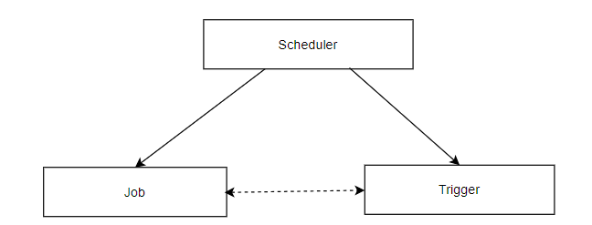
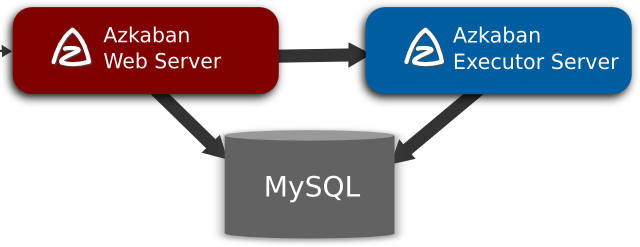
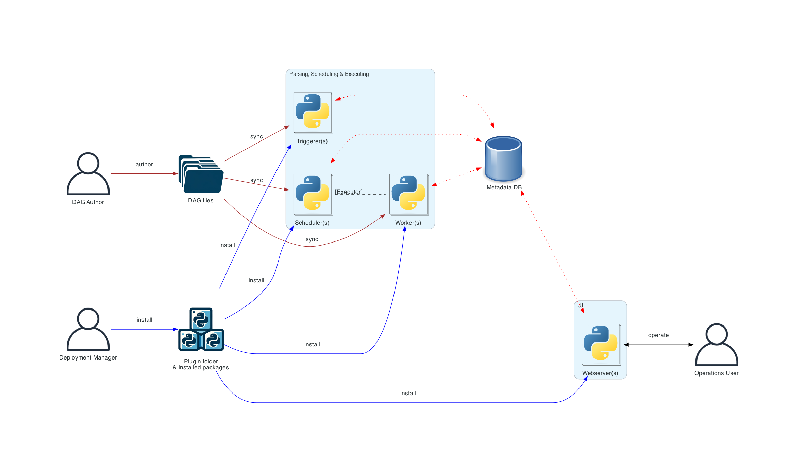
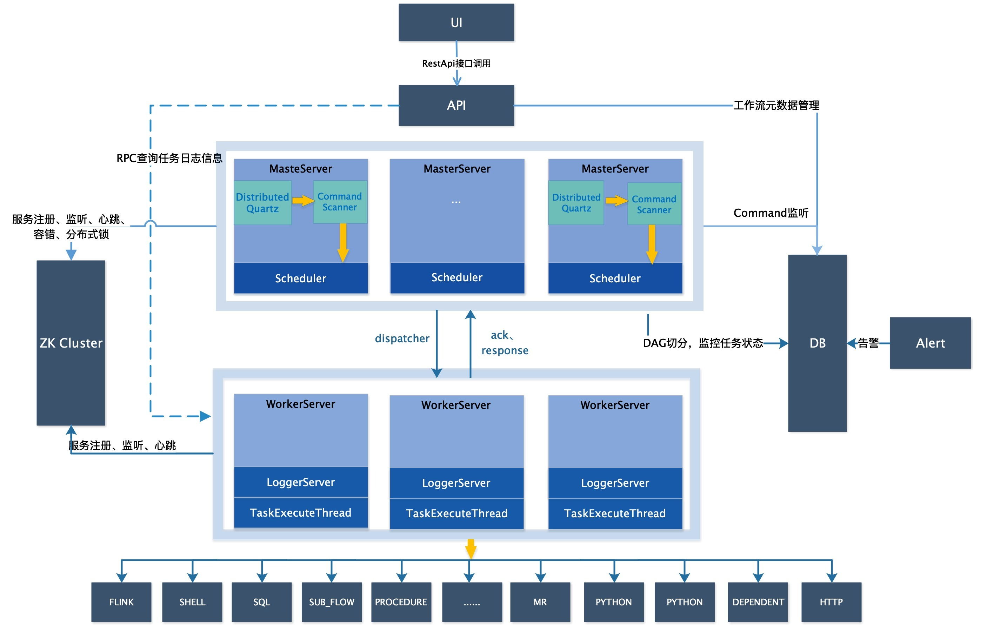

# 1、什么是任务调度系统

任务调度系统有点像平时工作与生活中使用的日程表和日程规划，**可以让某一类型的任务在某一特定的时刻执行，并且在这个任务执行完后，执行下一个类似的任务**。举个简单的例子，因为工作需要，你可能需要每天从数据库中抽取数据，然后做成报表，最后以邮件的形式发送给相关的领导。但是每个领导可能需要看的东西不一样，你需要在做成报表后对数据做下筛选和处理，那么每天这个重复的流程，是不是可以抽象称为一个具体的工作流程，把每个步骤具象成一个功能节点，然后以任务的形式串联起来，通过 DAG （有向无环图）的可视化形式展示出来，每天定时跑一下就可以了呢？为此，我们会需要一个工作流来标准化和自动化这个流程。来做这部分工作的就是本文任务调度工具的职责。

# 2、分布式定时调度和大数据任务调度

前面文章我们有分析了常见的分布式定时任务调度框架，那与我们本文需要分析的大数据任务调度工具有哪些区别

- 前面文章中的分布式任务调度我们有提到`任务调度是指基于给定的时间点，给定的时间间隔或者给定执行次数自动的执行任务。` 介绍的框架 Elastic-job 和 Quartz 等，主要关注的点其实还是定时的任务触发，没有很具体对于任务依赖的支持。

- 大数据的任务调度工具的重心点放在了流程管理和任务编排上，各个相互依赖的流程任务执行时间点管理。这个流程也有一个官方的名称叫做：`DAG 工作流` ，**DAG（有向无环图）**对于我们的任务编排上，可以很好的表示各任务间的依赖关系。这也是任务调度系统的核心点。

# 3、主流的任务调度工具

在基本了解了任务调度系统之后，接下来主要对常用的开源任务调度工具做下介绍和对比，方便各位作为了解和技术选型的内容。下面我们具体分析

## 3.1、Azkaban

Azkaban由 LinkedIn 开发实现，用以解决Hadoop作业依赖问题。 从 ETL 工作到数据分析产品，都需要按顺序运行作业。

最初是单一服务器（solo-server）解决方案，随着多年来Hadoop用户数量的增加，Azkaban 已经推出了更好的解决方案（multi server mode）。

Azkaban由三个关键组成部分组成：

- 数据库（MySQL）
- AzkabanWebServer
- AzkabanExecutorServer

### **3.1.1、数据库（MySQL）**

Azkaban 使用 MySQL 存储它的大部分状态，AzkabanWebServer 和 AzkabanExecutorServer 都会与数据库进行交互。

### **3.1.2、AzkabanWebServer**

AzkabanWebServer 是 Azkaban 的主要管理者。它处理项目管理，认证，调度程序和执行监控。也作为用户界面提供可视化的状态展示。

### **AzkabanWebServer 和 MySQL 的交互**

- **项目管理：**项目管理，项目权限控制，上传的文件等。
- **执行流程状态：**跟踪执行流程，跟踪执行流程的执行者。
- **上一个流程/作业：**搜索以前执行的作业和流程，以及访问其日志文件。
- **调度程序：**保存预定作业的状态
- **SLA：**保存所有的SLA规则

### **3.1.3、AzkabanExecutorServer**

AzkabanExecutorServer 负责处理工作流和作业的实际执行。

初始版本的 Azkaban 在`solo-server模式`中同时具有 AzkabanWebServer 和 AzkabanExecutorServer 功能，但是只能用于小规模用例。随着用户量的增长，正式的使用中 AzkabanExecutorServer 需要分离，使用`Multi Executor Server` 提升可扩展性。方便我们对于执行器的失败重试和扩展，处理过程也可以让其对用户的影响最小化。

### **AzkabanExecutorServer 和 MySQL 的交互**

- **访问项目：**从数据库中检索项目文件。
- **执行流程/作业：**检索并更新正在执行的流程的数据。
- **日志：**将作业和流程的输出日志存储到数据库中。
- **互流依赖性：**如果流在另一个执行器上运行，它可从数据库中获取状态。

### 3.1.4、Azkaban 的特点

- 易于使用的 Web UI
- 与任何版本的Hadoop兼容
- 简单的 Web 和 http 工作流上传
- 调度工作流
- 重试失败的作业。
- 支持插件扩展，模块化和可插拔的插件机制。
- 完整的权限管理系统，
- 项目工作区，不同的项目可以归属于不同的空间，而且不同的空间又可以设置不同的权限 多个项目之间是不会产生任何的影响与干扰。

### 3.1.5、Azkaban 优缺点

**优点：简单，上手快**

- 在所有引擎中，Azkaban 可能是最容易开箱即用的。UI 非常直观且易于使用。调度和 REST API 工作得很好。
- 有限的 HA 设置开箱即用。不需要负载均衡器，因为你只能有一个 Web 节点。你可以配置它如何选择执行程序节点然后才能将作业推送到它，只要有足够的容量来执行程序节点，就可以轻松运行数万个作业。
- Azkaban有较完善的权限控制。

**缺点**

- 出现失败的情况：Azkaban 会丢失所有的工作流，因为 Azkaban 将正在执行的 workflow 状态保存在内存中。
- 操作工作流：Azkaban 使用Web操作，不支持 RestApi，Java API 操作
- Azkaban 可以直接操作 shell 语句。在安全性上 Oozie 会比较好

## 3.2、**Oozie**

Oozie由Cloudera公司贡献给Apache的基于工作流引擎的开源框架,是用于Hadoop平台的开源的工作流调度引擎,是用来管理Hadoop作业,属于web应用程序，由Oozie client和Oozie Server两个组件构成,Oozie Server运行于Java Servlet容器（Tomcat）中的web程序。

Oozie 的架构如下：

主要由三部分组成

- **Oozie Client**：提供命令行、java api、rest 等方式，对 Oozie 的工作流流程的提交、启动、运行等操作；
- **Oozie Serve**r：本质是一个 java 应用。可以使用内置的 web 容器，也可以使用外置的 web 容器；
- **Hadoop Cluster**：底层执行 Oozie 编排流程的各个 hadoop 生态圈组件；

### 3.2.1、Oozie 基本原理

Oozie对工作流的编排，是基于 workflow.xml 文件来完成的。用户预先将工作流执行规则定制于workflow.xml 文件中，并在 job.properties 配置相关的参数，然后由 Oozie Server 向 MR 提交 job 来启动工作流。

### 3.2.2、Oozie 流程节点

工作流由两种类型的节点组成，分别是：

- Control Flow Nodes：控制工作流执行路径，包括start、end、kill、decision、fork、join；
- Action Nodes：决定每个操作执行的任务类型，包括MapReduce、java、hive、shell 等。

### 3.2.3、Oozie 三层结构

我们在官网介绍中可以注意到了，Oozie主要有三个主要概念，分别是 ***workflow***，***coordinator***，***bundle***。

**Workflow：**工作流，由我们需要处理的每个工作组成，进行需求的流式处理。包含**控制节点**和**动作节点**：

- **控制节点(CONTROL NODE)**：控制流节点一般都是定义在工作流开始或者结束的位置，比如`start、end、kill`等。以及提供工作流的执行路径机制,如`decision、fork、join`等。
- **动作节点(ACTION NODE) :** 负责执行具体动作的节点，比如：拷贝文件，执行某个`hive、shell、sqoop、pig、mr`等等。

流程图如下：

**Coordinator：**协调器，可以理解为工作流的协调器，可以将多个工作流协调成一个工作流来进行处理，是对要进行的顺序化的workflow的抽象，定时触发一个 workflow。流程图如下：

**Bundle：**捆，束。将一堆的coordinator进行汇总处理，是对一堆coordiantor的抽象，用来绑定多个coordinator或者多个workflow，流程图如下：

简单来说，workflow 是对要进行的顺序化工作的抽象，coordinator 是对要进行的顺序化的 workflow 的抽象，bundle 是对一堆 coordiantor 的抽象。层级关系层层包裹。

Oozie 本质是通过 launcher job 运行某个具体的 Action。launcher job 是一个 map-only 的MR作业，而且并不知道它将在集群的哪台机器上执行这个MR作业。

### 3.2.4、Oozie 的特点

- Oozie 是管理 hadoop 作业的调度系统；
- Oozie 的工作流作业是一系列动作的**有向无环图（DAG）**；
- Oozie 协调作业是通过**时间（频率）和有效数据**触发当前的 Oozie 工作流程；
- 工作流通过`hPDL`定义(一种 XML 流程定义语言)；
- 资源文件(脚本、jar包等)存放在 HDFS；
- Oozie 支持各种 hadoop 作业，例如：java map-reduce、Streaming map-reduce、pig、hive、sqoop 和 distcp 等等，也支持系统特定的作业，例如 java 程序和 shell 脚本；
- Oozie 是一个可伸缩，可靠和可拓展的系统。

### 3.2.5、 Oozie 优缺点

**优点：**

- Oozie 与 Hadoop 生态系统紧密结合，提供做种场景的抽象。
- Oozie 有更强大的社区支持，文档。
- Job 提交到 hadoop 集群，server 本身并不启动任何 job。
- 通过 control node/action node 能够覆盖大多数的应用场景。
- Coordinator 支持时间、数据触发的启动模式。
- 支持参数化和EL语言定义 workflow，方便复用。
- 结合 HUE，能够方便的对 workflow 查看以及运维，能够完成 workflow 在前端页面的编辑、提交 能够完成 workflow 在前端页面的编辑、提交。
- 支持 action 之间内存数据的交互。
- 支持 workflow 从某一个节点重启。

**缺点：**

- 对于通用流程调度而言，不是一个非常好的候选者，因为 XML 定义对于定义轻量级作业非常冗长和繁琐。
- 它还需要相当多的外设设置。你需要一个 zookeeper 集群，一个 db，一个负载均衡器，每个节点都需要运行像 Tomcat 这样的 Web 应用程序容器。初始设置也需要一些时间，这对初次使用的用户来说是不友好的。

## 3.3、Airflow

Airflow 是一个使用 python 语言编写的 data pipeline 调度和监控工作流的平台。 Airflow 是通过 DAG（Directed acyclic graph 有向无环图）来管理任务流程的任务调度工具， 不需要知道业务数据的具体内容，设置任务的依赖关系即可实现任务调度。

这个平台拥有和 Hive、Presto、MySQL、HDFS、Postgres 等数据源之间交互的能力，并且提供了钩子（hook）使其拥有很好地扩展性。 除了一个命令行界面，该工具还提供了一个基于 Web 的用户界面可以可视化管道的依赖关系、监控进度、触发任务等。

Airflow 的工作流程图如下：

所以我们可以知道，一个正常运行的 Airflow 系统一般由以下几个内容组成：

- **Meta data**：元数据库这个数据库存储有关任务状态的信息。
- **Scheduler** ：调度器是一种使用 DAG 定义结合元数据中的任务状态来决定哪些任务需要被执行以及任务执行优先级的过程。 调度器通常作为服务运行。
- **Executor** ：执行器是一个消息队列进程，它被绑定到调度器中，用于确定实际执行每个任务计划的工作进程。 有不同类型的执行器，每个执行器都使用一个指定工作进程的类来执行任务。 例如，LocalExecutor 使用与调度器进程在同一台机器上运行的并行进程执行任务。 其他像 CeleryExecutor 的执行器使用存在于独立的工作机器集群中的工作进程执行任务。
- **Workers**：这些是实际执行任务逻辑的进程，由正在使用的执行器确定。
- **Web Server:** 就是一个前端服务器，最后执行完这样一个 airflow 进程，我们所有的机器学习工程都可以在 airflow 平台的 WebUI 上进行操作，监控进程，触发进程等。

### 3.3.1、架构图

官网也给出了三种部署架构图的形式，这里说明常见一种的分布式架构。在一个可扩展的生产环境中，通常如下：

不同连接类型的含义如下：

- **棕色实线**表示 *DAG 文件*提交和同步
- **蓝色实线**表示部署和访问*已安装的软件包*和*插件*
- **黑色虚线**表示*调度程序*（通过执行器）对工作线程的控制流
- **黑色实线**表示访问 UI 以管理工作流的执行
- **红色虚线**表示所有组件访问*元数据数据库*

### **3.3.2、airflow核心模块**

具体在使用过程中，我们需要关注的核心模块主要有以下部分：

- **DAGs**：即有向无环图，将所有需要运行的 tasks 按照依赖关系组织起来，描述的是所有 tasks 执行顺序。
- **Operators**：可以简单理解为一个 class，描述了DAG中某个的task具体要做的事。其中，airflow内置了很多 operators，如 BashOperator 执行一个bash 命令，PythonOperator 调用任意的Python 函数，EmailOperator 用于发送邮件，HTTPOperator 用于发送HTTP请求， SqlOperator用于执行 SQL 命令等等，同时，用户可以自定义 Operator，这给用户提供了极大的便利性。
- **Task ：**Task 是 Operator 的一个实例，也就是 DAGs 中的一个 node。
    - **Task Instance**：task 的一次运行。Web 界面中可以看到 task instance 有自己的状态，包括 "running", “success”,“failed”,“skipped”, "up for retry" 等。
    - **Task Relationships**：DAGs 中的不同 Tasks 之间可以有依赖关系，如 Task1 >>Task2，表明Task2 依赖于 Task2 了。 通过将 DAGs 和 Operators 结合起来，用户就可以创建各种复杂的工作流（workflow）

### 3.3.3、Airflow 的特点

- 分布式任务调度：允许一个工作流的task在多台worker上同时执行；
- 可构建任务依赖：以有向无环图的方式构建任务依赖关系；
- task原子性：工作流上每个task都是原子可重试的，一个工作流某个环节的task失败可自动或手动进行重试，不必从头开始任务。

### 3.3.4、Airflow **优缺点**

**优点：**

- 提供了一个很好的UI，允许你通过代码/图形检查 DAG（工作流依赖性），并监视作业的实时执行。
- 高度定制 Airflow。

**缺点：**

- 部署几台集群扩容相对复杂及麻烦。
- Airflow的调度依赖于 crontab 命令，调度程序需要定期轮询调度计划并将作业发送给执行程序。
- 定期轮询工作，你的工作不能保证准时安排。
- 当任务数量多的时候，容易造成卡死。

## 3.4、**DolphinScheduler**

DolphinScheduler(Incubator,原 Easy Scheduler)是一个分布式数据工作流任务调度系统，主要解决数据研发 ETL 错综复杂的依赖关系，而不能直观监控任务健康状态等问题。Easy Scheduler 以 DAG 流式的方式将 Task 组装起来，可实时监控任务的运行状态，同时支持重试、从指定节点恢复失败、暂停及 Kill 任务等操作。

DolphinScheduler 的架构图如下：

### 3.4.1、架构说明

- **MasterServer**
    
    MasterServer 采用分布式无中心设计理念，MasterServer 主要负责 DAG 任务切分、任务提交监控，并同时监听其它 MasterServer 和 WorkerServer 的健康状态。 MasterServer 服务启动时向Zookeeper 注册临时节点，通过监听 Zookeeper 临时节点变化来进行容错处理。 MasterServer基于 netty 提供监听服务。
    
    ### 该服务内主要包含:
    
    - **DistributedQuartz** 分布式调度组件，主要负责定时任务的启停操作，当 quartz 调起任务后，Master 内部会有线程池具体负责处理任务的后续操作；
    - **MasterSchedulerService** 是一个扫描线程，定时扫描数据库中的`t_ds_command`表，根据不同的命令类型进行不同的业务操作；
    - **WorkflowExecuteRunnable** 主要是负责 DAG 任务切分、任务提交监控、各种不同事件类型的逻辑处理；
    - **TaskExecuteRunnable** 主要负责任务的处理和持久化，并生成任务事件提交到工作流的事件队列；
    - **EventExecuteService** 主要负责工作流实例的事件队列的轮询；
    - **StateWheelExecuteThread** 主要负责工作流和任务超时、任务重试、任务依赖的轮询，并生成对应的工作流或任务事件提交到工作流的事件队列；
    - **FailoverExecuteThread** 主要负责 Master 容错和 Worker 容错的相关逻辑；
- **WorkerServer**
    
    WorkerServer 也采用分布式无中心设计理念，WorkerServer 主要负责任务的执行和提供日志服务。 WorkerServer 服务启动时向 Zookeeper 注册临时节点，并维持心跳。 WorkerServer 基于netty 提供监听服务。
    
    ### 该服务包含：
    
    - **WorkerManagerThread** 主要负责任务队列的提交，不断从任务队列中领取任务，提交到线程池处理；
    - **TaskExecuteThread** 主要负责任务执行的流程，根据不同的任务类型进行任务的实际处理；
    - **RetryReportTaskStatusThread** 主要负责定时轮询向Master汇报任务的状态，直到 Master 回复状态的 ack，避免任务状态丢失；
- **ZooKeeper**
    
    ZooKeeper 服务，系统中的 MasterServer 和 WorkerServer 节点都通过 ZooKeeper 来进行集群管理和容错。另外系统还基于 ZooKeeper 进行事件监听和分布式锁。
    
- **AlertServer**
    
    提供告警服务，通过告警插件的方式实现丰富的告警手段。
    
- **ApiServer**
    
    API接口层，主要负责处理前端UI层的请求。该服务统一提供RESTful api向外部提供请求服务。
    
- **UI**
    
    系统的前端页面，提供系统的各种可视化操作界面。
    

### 3.4.2、DophinScheduler 的特点

**简单易用**

- **可视化 DAG**: 用户友好的，通过拖拽定义工作流的，运行时控制工具
- **模块化操作**: 模块化有助于轻松定制和维护。

**丰富的使用场景**

- **支持多种任务类型**: 支持 Shell、MR、Spark、SQL 等10余种任务类型，支持跨语言，易于扩展
- **丰富的工作流操作**: 工作流程可以定时、暂停、恢复和停止，便于维护和控制全局和本地参数。

**High Reliability**

- **高可靠性**: 去中心化设计，确保稳定性。 原生 HA 任务队列支持，提供过载容错能力。 DolphinScheduler 能提供高度稳健的环境。

**High Scalability**

- **高扩展性**: 支持多租户和在线资源管理。支持每天10万个数据任务的稳定运行。

## 4、主流调度任务调度工具对比

| 功能 | DolphinScheduler | Azkaban | Airflow | Oozie |
| --- | --- | --- | --- | --- |
| 定位 | 解决数据处理流程中错综复杂的依赖关系 | 为了解决 Hadoop 的任务依赖关系 | 通用的批量数据处理 | 管理 Hadoop 作业（job）的工作流程调度管理系统 |
| 任务类型支持 | 支持传统的 shell 任务，同时支持大数据平台任务调度：MR、Spark、SQL(mysql、postgresql、hive/sparksql)、python、procedure、sub_process | Command、HadoopShell、Java、HadoopJava、Pig、Hive等，支持插件式扩展 | Python、Bash、HTTP、Mysql等，支持 Operator 的自定义扩展 | 统一调度 hadoop系统中常见的 MR 任务启动、Java MR、Streaming MR、Pig、Hive、Sqoop、Spark、Shell等 |
| 可视化流程定义 | 是所有流定时操作都是可视化的，通过拖拽来绘制 DAG,配置数据源及资源，同时对于第三方系统，提供 api方式的操作。 | 否，通过自定义DSL 绘制 DAG 并打包上传 | 否，通过 python 代码来绘制 DAG ,使用不便 | 否，配置相关的调度任务复杂，依赖关系、时间触发、事件触发使用xml语言进行表达 |
| 任务监控支持 | 任务状态、任务类型、重试次数、任务运行机器、可视化变量等关键信息一目了然 | 只能看到任务状态 | 不能直观区分任务类型 | 任务状态、任务类型、任务运行机器、创建时间、启动时间、完成时间等。 |
| 自定义任务类型支持 | 是 | 是 | 是 | 是 |
| 暂停/恢复/补数 | 支持暂停、恢复 补数操作 | 否，只能先将工作流杀死在重新运行 | 否，只能先将工作流杀死在重新运行 | 支持启动/停止/暂停/恢复/重新运行：Oozie 支持Web，RestApi，Java API 操作 |
| 高可用支持 | 支持 HA 去中心化的多Master 和多 Worker | 通过 DB 支持 HA 但 Web Server 存在单点故障风险 | 通过 DB支持 HA 但Scheduler 存在单点故障风险 | 通过 DB 支持 HA |
| 多租户支持 | 支持 dolphinscheduler 上的用户可以通过租户和hadoop 用户实现多对一或一对一的映射关系，这对大数据作业的调度是非常重要。 | 否 | 计划中 | 否 |
| 过载能力 | 任务队列机制，单个机器上可调度的任务数量可以灵活配置，当任务过多时会缓存在任务队列中，不会操作机器卡死 | 任务太多时会卡死服务器 | 任务太多时会卡死服务器 | 调度任务时可能出现死锁 |
| 集群扩展支持 | 是，调度器使用分布式调度，整体的调度能力会随集群的规模线性正常，Master和 Worker 支持动态上下线 | 是-只 Executor 水平扩展 | 是-只 Executor 水平扩展 | 是 |

## 5、总结

本文主要介绍了：

- 任务调度系统的基本概念，任务调度系统主要是为了解决哪些问题；
- 分布式定时调度框架和大数据任务调度工具侧重点，理解上的区别；
- 主流的任务调度工具介绍，DolphinScheduler、Azkaban、Airflow、Oozie 的基本概念和特点；
- 主流的任务调度工具对比。
