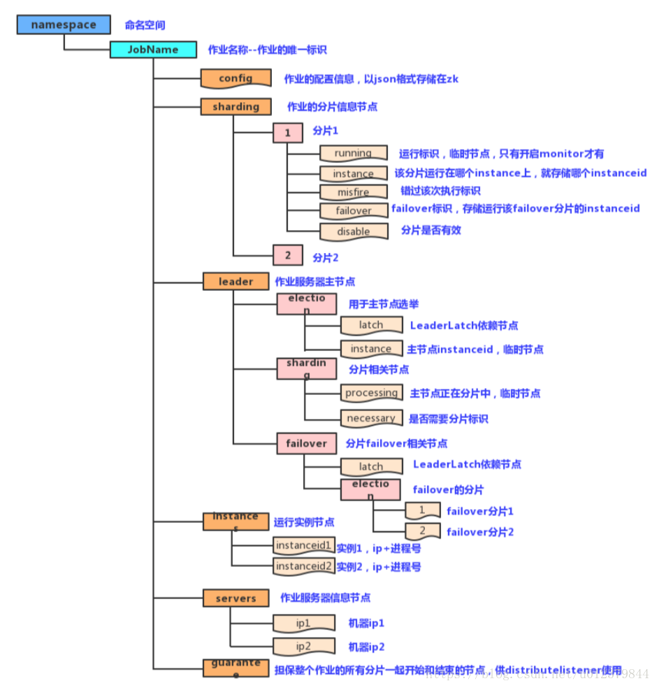
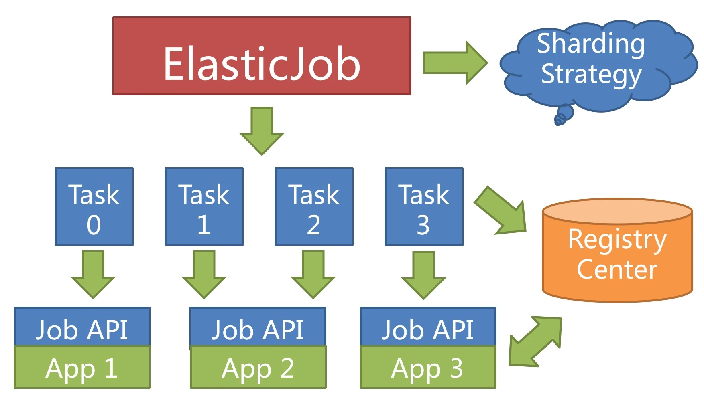
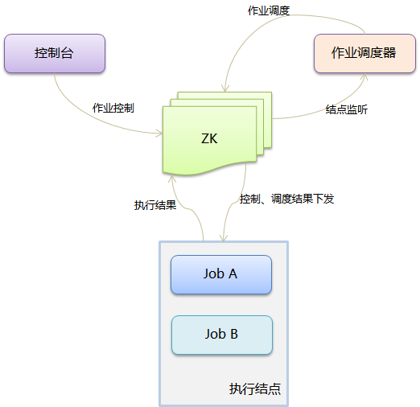
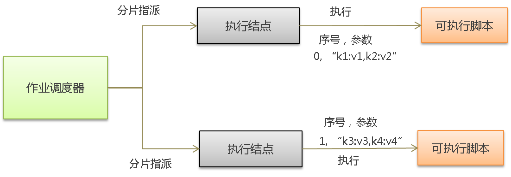
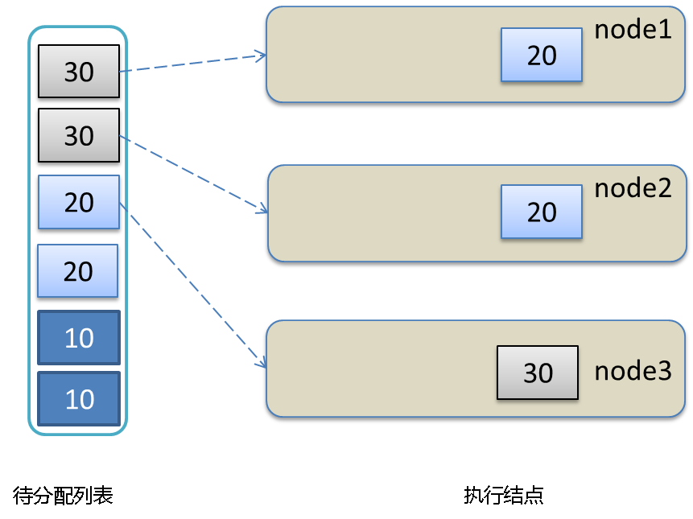
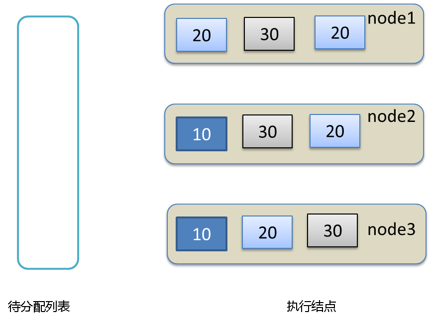
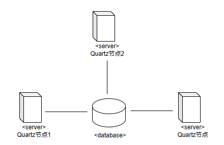
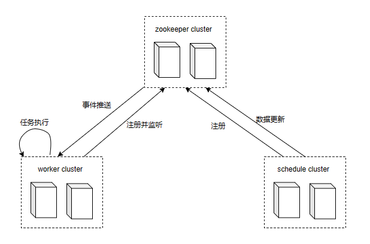
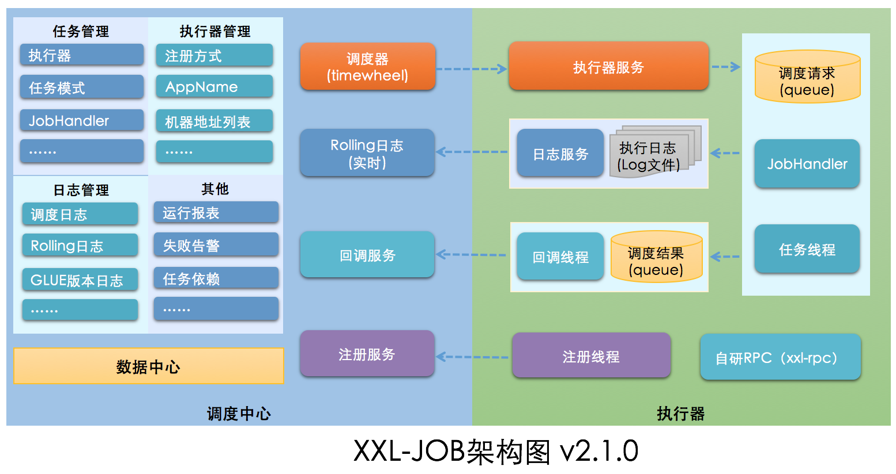
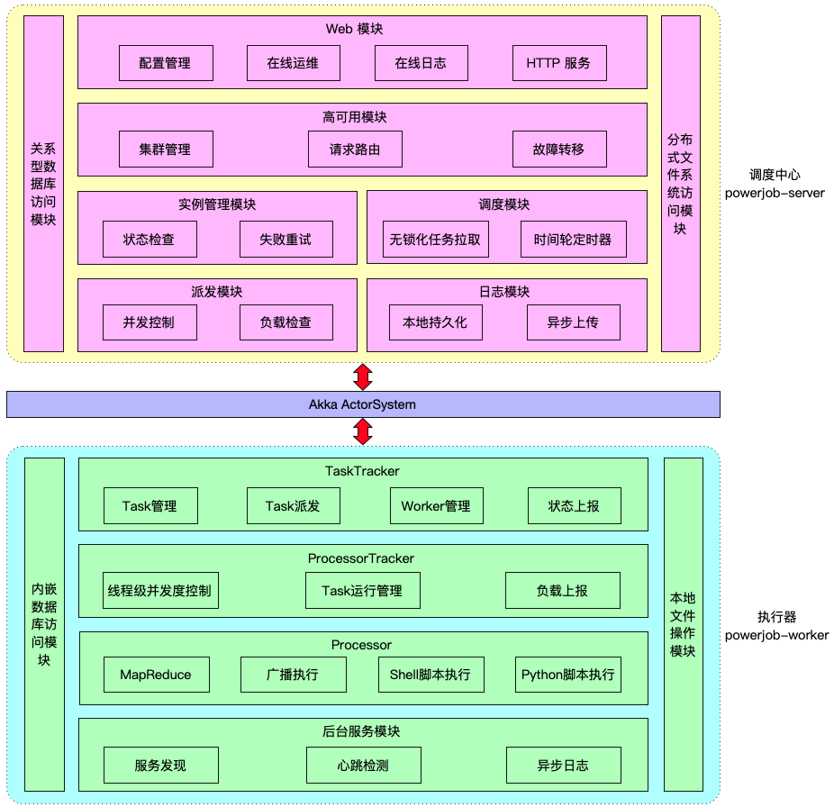

# **分布式任务调度框架**

## **1、什么是分布式任务调度**

任务调度是指基于**给定的时间点**，**给定的时间间隔**或者给定执行次数自动的**执行任务**。无论是互联网应用或者企业级应用，都无可避免的会需要一些定时任务来解决问题。通常我们框架会自带部分解决方案，但是随着应用复杂度升高，例如架构的逐步演进，单体架构逐渐演变为分布式、微服务架构。定时任务数量增多且任务之间产生依赖关系式，很多原先的任务调度平台已经不能满足业务系统的需求。随着分布式服务架构趋势，相应也需要一个分布式任务调度系统来管理分布式架构中的定时任务。

## 2、分布式任务调度的关键点

分布式任务调度有着三个最重要的关键点：分布式、任务调度、配置中心。

**分布式**：平台需要是可以分布式部署的，各个节点之间可以无状态和无限的水平扩展；

**任务调度**：涉及到任务状态管理、任务调度请求的发送与接收、具体任务的分配、任务的具体执行；（这里又会遇到一共要处理哪些任务、任务要分配到哪些机器上处理、任务分发的时候判断哪些机器可以用等问题，所以又需要一个可以感知整个集群运行状态的配置中心）

**配置中心**：可以感知整个集群的状态、任务信息的注册

基于这三个关键点，常见的分布式任务调度通常会需要以下内容：

- **Web模块**：用来提供任务的信息，控制任务的状态、信息展示等。
- **Server模块**：负责接收web端传来的任务执行的信息，下发任务调度请求给Scheduler，会去注册中心进行注册
- **Scheduler模块**：接收server端传来的调度请求，将任务进行更加细化的拆分然后下发，到注册中心进行注册，获取到可以干活的worker。
- **Worker模块**：负责具体的任务执行。
- **注册中心：**服务注册，服务发现。

## 3、**常见的分布式任务调度框架**

接下来主要对于市场上主流的开源分布式任务调度框架做下介绍和对比，方便各位作为了解和技术选型的参考内容。下面我们先了解下具体的区别。

### 3.1、Elastic-job

Elastic-job 是当当网开源的一款非常好用的作业框架，功能主要有 弹性调度、资源分配、作业治理和可视化管控。Elastic-job 在 2.x 之后，出现了两个相互独立的子项目：Elastic-job-lite 和 Elastic-job-cloud 。2017~2020 年中间在版本停滞了几年后，在 2020 年又重启了维护，对内核进行了大量的结构和重构，发布了 3.0 版本，并成为了 Apache ShardingSphere 的子项目。

### 3.1.1、Elastic-job-lite

Elastic-job-lite 定位为轻量级无中心化的解决方案，是面向进程内的线程级调度框架，使用 jar 包的形式提供分布式任务的协调服务，外部依赖仅依赖于 zookeeper。Elastic-job-lite 的架构图如下图所示：

从上面的框架图中可以看出，Elastic-job-lite 框架使用 zookeeper 作为注册中心，Elastic-job-lite 框架通过监听感知 zookeeper 数据的变化，并做相应的处理；运维平台也仅是通过读取zk数据来展现作业状态，或是更新 zookeeper 数据修改全局配置。运维平台和 Elastic-job-lite 没有直接的关系，完全解耦合。Elastic-job-lite 并不直接提供数据处理的功能，框架只会将分片项分配给各个正在运行中的服务器，分片项与真是数据的对应关系需要开发者在应用程序中自行处理。

Elastic-job-lite 并无作业调度中心节点，而是基于部署作业框架的程序在到达相应时间点时各自触发调度。注册中心仅用于作业注册和监控信息存储，而主作业节点仅用于处理分片和清理的功能。

**（1）注册中心的数据结构**

我们先来了解一下该框架在 zookeeper 上的节点情况。首先注册中心在命名的空间下创建作业名称节点（作业名称用来区分不同的作业，一旦修改名称，则认为是新的作业），作业名称节点下又包含5个子节点：

- **config 节点**：保存作业的配置信息，以 JSON 格式存储（3.0 以 YAML 格式存储）
- **instances 节点**：作业运行实例信息，子节点是当前作业运行实例的主键。 作业运行实例主键由作业运行服务器的 IP 地址和 PID 构成。 作业运行实例主键均为临时节点，当作业实例上线时注册，下线时自动清理。注册中心监控这些节点的变化来协调分布式作业的分片以及高可用。 可在作业运行实例节点写入 TRIGGER 表示该实例立即执行一次。
- **leader 节点**：该节点保存作业服务器主节点的信息，分为 election、sharding 和 failover 三个子节点，分别用于主节点的选举、分片和失效转移
- **servers 节点：**作业服务器信息，子节点是作业服务器的 IP 地址。 可在 IP 地址节点写入 DISABLED 表示该服务器禁用。 在新的云原生架构下，servers 节点大幅弱化，仅包含控制服务器是否可以禁用这一功能。 为了更加纯粹的实现作业核心，servers 功能未来可能删除，控制服务器是否禁用的能力应该下放至自动化部署系统。
- **sharding 节点**：作业分片信息，子节点是分片项序号，从零开始，至分片总数减一。 分片项序号的子节点存储详细信息。每个分片项下的子节点用于控制和记录分片运行状态。 节点详细信息说明：
    
    
    | 子节点名 | 临时节点 | 描述 |
    | --- | --- | --- |
    | instance | 否 | 执行该分片项的作业运行实例主键 |
    | running | 是 | 分片项正在运行的状态仅配置 monitorExecution 时有效 |
    | failover | 是 | 如果该分片项被失效转移分配给其他作业服务器，则此节点值记录执行此分片的作业服务器 IP |
    | misfire | 否 | 是否开启错过任务重新执行 |
    | disabled | 否 | 是否禁用此分片项 |

**（2）弹性分布式实现原理**

1. 第一台服务器上线触发主服务器选举，主服务器一旦下线，则重新触发选举，选举过程中阻塞，只有当主服务器选举完成，才会去执行其他的任务；
2. 某服务器上线时会自动将服务器的信息注册到注册中心，下线时会自动更新服务器的状态；
3. 主节点选举，服务器上下线，分片总数变更均更新重新分片标记；
4. 定时任务触发时，如需重新分片，则通过主服务器分片，分片过程中阻塞，分片结束后才可以执行任务。如分片过程中主服务器下线，则先选举主服务器在分片；
5. 由上一项说明可知，为了维持作业运行时的稳定性，运行过程中只会标记分片的状态，不会重新分片，分片仅可能发生在下次任务触发前；
6. 每次分片都会按照ip排序，保证分片结果不会产生较大的波动；
7. 实现失效转移功能，在某台服务器执行完毕后主动抓取未分配的分片，并且在某台服务器下线后主动寻找可用的服务器执行任务。

**（3）弹性调度**

elastic-job 底层的任务调度还是使用的 quartz，通过 zookeeper 来动态给 job 节点分片。如果很大体量的用户需要我们在特定的时间段内计算完成，那么我们肯定是希望我们的任务可以通过集群达到水平的扩展，集群里的每个节点都处理部分的用户，不管用户的数量有多大，我们只需要增加机器就可以了。ElasticJob 中任务分片项的概念，使得任务可以在分布式的环境下运行，每台任务服务器只运行分配给该服务器的分片。随着服务器的增加或宕机，ElasticJob 会近乎实时的感知服务器数量的变更，从而重新为分布式的任务服务器分配更加合理的任务分片项，使得任务可以随着资源的增加而提升效率。

举例说明，如果作业分为 4 片，用两台服务器执行，则每个服务器分到 2 片，如下图所示

当新增加作业服务器时，ElasticJob 会通过注册中心的临时节点的变化感知到新服务器的存在，并在下次任务调度的时候重新分片，新的服务器会承载一部分作业分片，分片如下图所示。

当作业服务器在运行中宕机时，注册中心同样会通过临时节点感知，并将在下次运行时将分片转移至仍存活的服务器，以达到作业高可用的效果。本次由于服务器宕机而未执行完的作业，则可以通过失效转移的方式继续执行。作业高可用如下图所示。

**（4）资源分配**

调度是指在适合的时间将适合的资源分配给任务，并使其生效。ElasticJob 具备资源分配的能力，它能够像分布式的操作系统一样调度任务。资源分配是借由 Mesos 实现的，由 Mesos 负责分配任务声明的所需资源（CPU 和内存），并将分配出去的资源进行隔离。ElasticJob 在获取到资源之后才会执行任务。

考虑到 Mesos 系统部署相对复杂，因此 ElasticJob 将这部分拆分至 ElasticJob cloud 部分，供高级用户使用。随着 Kubernetes 的强劲发展，ElasticJob 未来也会完成 cloud 部分与它的对接。

**（5）作业治理**

作业在分布式场景下的高可用、失效转移、错过作业重新执行等行为的治理和协调。

**（6）可视化管控端**

主要包括作业的增删改查管控端、执行历史记录查询、配置中心的管理等。

### 3.1.2、Elastic-job-cloud

Elastic-job-cloud 包含了 Elastic-job-lite 的全部功能，拥有进程内调度和进程级别调度两种方式，它是以私有云平台的方式提供集资源、调度以及分片为一体的全量级解决方案，依赖于 Mesos 和 Zookeeper ，它额外提供了资源治理、应用分发以及进程隔离等服务。他们两个提供同一套API开发作业，开发者仅需一次开发，然后可根据需要以 lite 或 cloud 的方式部署。Elastic-job-cloud 的架构图如下图所示：

### 3.2、saturn

Saturn（定时任务调度系统）是唯品会自主研发的分布式的定时任务的调度平台，它是基于 Elastic-job版本1开发的。目标是取代传统的 Linux Cron/Spring Batch Job/Quartz 的方式，做到全域统一配置、统一监控、任务高可用以及分片。Saturn 的任务可以使用多种语言开发，比如 python、Go、Shell、Java、Php 等。

Saturn 包括两大部分，Saturn Console 和 Saturn Executor。

`**Saturn Console**` ：Console 是一个WEB UI，用来对作业/Executor 的管理，统计报表展现等。他同时也是整个调度系统的大脑：将作业任务分配到各Executor。

`**Saturn Executor**` ：Executor 是执行任务的worker：按照作业配置的要求去执行部署于Executor所在容器或物理机当中的作业脚本和代码。Saturn高度依赖于zookeeper，每个executor及调度服务都会在zookeeper上进行注册，确保调度程序能够及时得到executor的状态。

Saturn 定时任务调度的最小单位是分片，即任务的一个执行单元。Saturn 的基本任务就是将任务分成多个分片，并将每个分片通过算法调度到对应的 executor 上去执行。

### 3.2.1、Staurn基本原理

Saturn的基本原理是将作业在逻辑上划分为若干个分片，通过作业分片调度器将作业分片指派给特定的执行节点。执行节点通过quartz触发执行作业的具体实现，在执行的时候，会将分片序号和参数作为参数传入。作业的实现逻辑需分析分片序号和分片参数，并以此为依据来调用具体的实现（比如一个批量处理数据库的作业，可以划分0号分片处理1-10号数据库，1号分片可以处理11-20号数据库）。

### 3.2.2、Saturn 作业调度算法

1. **方案的设计**

原理是给每个作业分片一个负载值和优先执行节点（prefer list），当需要重新分片时，参考作业优先设定和执行节点的负载值来进行域内节点之间的资源分配，从而达到资源平衡。

1. **前置条件**
- a. 每个作业引入负载(load)属性，由用户通过Saturn UI界面输入；比如一个作业分片是3，作业负载(load)是20，则每个作业分片的负载(load)都是20。
- b. 为每一个作业引入一个新的属性prefer list（优先列表，或者叫预分配列表），由管理员通过ui界面编辑。
- c. 作业引入启用状态(enabled/disabled)，用户通过saturn ui界面操作来修改这个状态（启用/禁用按键）；启用状态的作业会被执行结点执行，禁用状态的作业不会被执行；启用状态的作业不可编辑（不可调整分片大小，不可调整prefer list)、删除，禁用状态的作业可编辑、删除。
1. **实施步骤**

第一步，摘取；第二步，放回（将这些作业分片按照负载值从大到小顺序逐个分配给负载最小的执行节点）。

**3.1 executor上线**

**摘取：**

第一步，找出新上线节点的全部可执行作业列表；对于每个作业，判断prefer list中是否包含了新上线的节点；如果是，则摘取其中全部的分片；这些已经处理过的作业称为预处理作业；

第二步，从新上线节点的作业列表中减去预分配作业，然后使用以下的方法依次摘取：

1. 假如上线的executor为a，它能处理的作业类型为j1，j2（已减去预分配列表）。遍历当前域下的executor列表，拿掉全部作业类型为j1，j2的分片，加上尚未分配的j1，j2作业分片列表，作为算法的待分配列表
2. 在处理每个节点时，每拿掉一个作业分片后判断被拿掉的负载（load）是否已经超过了自身处理前总负载（load）的1/n（n为当前executor节点的总数量），如果超过，则本执行节点摘取完成，继续处理下一个执行节点；如果不超过则继续摘取，直到超过（大于等于）为止。

**放回：**

使用平衡算法组个处理待分配列表中的作业分片

- 构造需要添加的作业分片列表，我们起名为待分配列表，长度为n，待分配列表按照负载（load）从大到小排序，排序时需保证相同作业的所有分片时连续的
- 构造每种作业类型的executor列表（如果有prefer list，且有存活，则该作业的executor列表就是prefer list），得到一个map<jobName,executorList>’
- 从待分配列表中依次取出第0到第n-1个作业分片jobi
- 从map中取出可运行jobi的executor列表listi
- 将jobi分配给listi中负载总和最小的executor

举例如下：

**放回前：**

**第一轮放回：**

**第二轮放回（结束）：**

**3.2 executor下线**

摘取：取出下线的executor当前分配到的全部作业分片，作为算法的待分配列表

放回：使用平衡算法逐个处理待分配列表中的作业分片

**3.3 作业启动**

摘取：从所有executor中摘取将被启动作业的全部分片作为算法的待分配列表

放回：使用调整后的平衡算法放回

**3.4 作业停止**

摘取：将被停止的作业分片从各节点删除

返回：无

> 注：Saturn 架构文档请见[https://github.com/vipshop/Saturn/wiki/Saturn架构文档](https://github.com/vipshop/Saturn/wiki/Saturn%BC%DC%B9%B9%CE%C4%B5%B5)
> 

### 3.3、quartz

Quartz 是 OpenSymphony 开源组织在任务调度领域的一个开源项目，完全基于 java 实现。作为一个优秀的开源框架，Quartz 具有以下特点：强大的调度功能、灵活的应用方式、分布式和集群能力，另外作为 spring 默认的调度框架，很容易实现与 Spring 集成，实现灵活可配置的调度功能。

Quartz 的核心元素如下：

- **Scheduler**：任务调度器，是实际执行任务调度的控制器
- **Trigger：**触发器，用于定义任务调度的时间规则
- **Calendar**：它是一些日历特定时间的集合，一个Trigger可以包含多个Calendar，以便于排除或包含某些时间点
- **JobDetail**：用来描述Job实现类及其他相关的静态信息，如Job的名字、关联监听器等信息
- **Job**：是一个接口，只有一个方法void execute(JobExecutionContext context)，开发者实现该接口定义运行任务，JobExecutionContext类提供了调度上下文的各种信息

Quartz 的单机版大家应该都比较熟悉，它的集群方案是使用数据库来实现的。集群架构如下：

上图 3 个节点在数据库中都有同一份 Job 定义，如果某一个节点失效，那么 Job 会在其他节点上执行。因为每个节点上的代码都是一样的，那么如何保证只有一台机器上触发呢？答案是使用了数据库锁。在 quartz 集群解决方案了有张 **scheduler_locks**，采用了**悲观锁**的方式对 triggers 表进行了行加锁，以保证任务同步的正确性。

简单来说，quartz 的分布式调度策略是以数据库为边界的一种异步策略。各个调度器都遵守一个基于数据库锁的操作规则从而保证了操作的唯一性，同时多个节点的异步运行保证了服务的可靠。但这种策略有自己的局限性：集群特性对于高 CPU 使用率的任务效果特别好，但是对于大量的短任务，各个节点都会抢占数据库锁，这样就出现大量的线程等待资源。Quartz 的分布式**只解决了任务高可用的问题**，并没有解决任务分片的问题，还是会有单机处理的极限。

### 3.4、TBSchedule

TBSchedule 是一款非常优秀的分布式调度框架，广泛应用于阿里巴巴、淘宝、支付宝、京东、汽车之家等很多互联网企业的流程调度系统。TBSchedule 在时间调度方面虽然没有 quartz 强大，但是它支持分片的功能。和 quartz 不同的是，TBSchedule 使用 zookeeper 来实现任务调度的高可用和分片。纯 java 开发。

TBSchedule项目实际上可以分为两部分。

1）schedule管理控制台。负责控制、监控任务执行状态。

2）实际执行 job 的客户端程序。在实际使用时，需要先启动zk，然后部署 TBSchedule web 界面的管理控制台，最后启动实际执行job的客户端程序。这里的 zookeeper 并不实际控制任务调度，它只是负责与 N 台执行 job 任务的客户端进行通讯，协调、管理、监控这些机器的运行信息。实际分配任务的是管理控制台，控制台从 zookeeper 获取 job 的运行信息。TBSchedule 通过控制 ZNode 的创建、修改、删除来间接控制 job 的执行，执行任务的客户端监听它们对应 ZNode 的状态更新事件，从而达到 TBSchedule 控制 job 执行的目的。特点：

- TBSchedule 的分布式机制是通过灵活的 Sharding 方式实现的，比如可以按所有数据的 ID 按 10取模分片、按月份分片等，根据不同的场景由客户端配置分片规则。
- TBSchedule 的宿主服务器可以进行动态的扩容和资源回收，这个特点主要是因为它后端依赖的zooKeeper，这里的 zooKeeper 对于 TBSchedule 来说相当于 NoSQL，用于存储策略、任务、心跳等信息数据，他的数据结构类似于文件系统的目录结构，他的节点有临时节点、持久节点之分。一个新的服务器上线后，会在zk中创建一个代表当前服务器的一个唯一性路径（临时节点），并且新上线的服务器会和zk保持长连接，当通信断开后，节点会自动删除。
- TBSchedule 会定时扫描当前服务器的数量，重新进行任务分配。
- TBSchedule 不仅提供了服务端的高性能调度服务，还提供了一个 scheduleConsole war 随着宿主应用的部署直接部署到服务器，可以通过 web 的方式对调度的任务、策略进行监控管理，以及实时更新调整。

### 3.5、xxl-job

xxl-job是一个轻量级的分布式任务调度框架，其核心设计目标是开发迅速、学习简单、轻量级、易扩展。

xxl-job的设计思想为：

- 将调度行为抽象形成“调度中心”公共平台，而平台自身并不承担业务逻辑，“调度中心”负责发起调度请求
- 将任务抽象成分散的 JobHandler，交由执行器统一管理，执行器负责接收调度请求并执行对应的 JobHandler 中业务逻辑

因此，“调度”和“任务”可以互相解偶，提高系统整体的稳定性和扩展性。

xxl-job系统的组成分为：

- 调度模块（调度中心）：负责管理调度信息，按照调度配置发出调度请求，自身不承担业务代码。调度系统与任务解耦，提高了系统可用性和稳定性，同时调度系统性能不再受限于任务模块；支持可视化、简单且动态的管理调度信息，包括任务新建，更新，删除，GLUE开发和任务报警等，所有上述操作都会实时生效，同时支持监控调度结果以及执行日志，支持执行器Failover。
- 执行模块（执行器）：负责接收调度请求并执行任务逻辑。任务模块专注于任务的执行等操作，开发和维护更加简单和高效；接收“调度中心”的执行请求、终止请求和日志请求等。

xxl-job 的执行流程：

首先准备一个将要执行的任务，任务开启后到执行器中注册任务的信息，加载执行器的配置文件，初始化执行器的信息，然后执行器 start。在 admin 端配置任务信息，配置执行器的信息。就可以控制任务的状态了。

xxl-job的特性为：

1. 简单：支持通过Web页面对任务进行CRUD操作，操作简单，一分钟上手；
2. 动态：支持动态修改任务状态、启动/停止任务，以及终止运行中任务，即时生效；
3. 调度中心HA（中心式）：调度采用中心式设计，“调度中心”自研调度组件并支持集群部署，可保证调度中心HA；
4. 执行器HA（分布式）：任务分布式执行，任务”执行器”支持集群部署，可保证任务执行HA；
5. 注册中心: 执行器会周期性自动注册任务, 调度中心将会自动发现注册的任务并触发执行。同时，也支持手动录入执行器地址；
6. 弹性扩容缩容：一旦有新执行器机器上线或者下线，下次调度时将会重新分配任务；
7. 触发策略：提供丰富的任务触发策略，包括：Cron触发、固定间隔触发、固定延时触发、API（事件）触发、人工触发、父子任务触发；
8. 调度过期策略：调度中心错过调度时间的补偿处理策略，包括：忽略、立即补偿触发一次等；
9. 阻塞处理策略：调度过于密集执行器来不及处理时的处理策略，策略包括：单机串行（默认）、丢弃后续调度、覆盖之前调度；
10. 任务超时控制：支持自定义任务超时时间，任务运行超时将会主动中断任务；
11. 任务失败重试：支持自定义任务失败重试次数，当任务失败时将会按照预设的失败重试次数主动进行重试；其中分片任务支持分片粒度的失败重试；
12. 任务失败告警；默认提供邮件方式失败告警，同时预留扩展接口，可方便的扩展短信、钉钉等告警方式；
13. 路由策略：执行器集群部署时提供丰富的路由策略，包括：第一个、最后一个、轮询、随机、一致性HASH、最不经常使用、最近最久未使用、故障转移、忙碌转移等；
14. 分片广播任务：执行器集群部署时，任务路由策略选择”分片广播”情况下，一次任务调度将会广播触发集群中所有执行器执行一次任务，可根据分片参数开发分片任务；
15. 动态分片：分片广播任务以执行器为维度进行分片，支持动态扩容执行器集群从而动态增加分片数量，协同进行业务处理；在进行大数据量业务操作时可显著提升任务处理能力和速度。
16. 故障转移：任务路由策略选择”故障转移”情况下，如果执行器集群中某一台机器故障，将会自动Failover切换到一台正常的执行器发送调度请求。
17. 任务进度监控：支持实时监控任务进度；
18. Rolling实时日志：支持在线查看调度结果，并且支持以Rolling方式实时查看执行器输出的完整的执行日志；
19. GLUE：提供Web IDE，支持在线开发任务逻辑代码，动态发布，实时编译生效，省略部署上线的过程。支持30个版本的历史版本回溯。
20. 脚本任务：支持以GLUE模式开发和运行脚本任务，包括Shell、Python、NodeJS、PHP、PowerShell等类型脚本;
21. 命令行任务：原生提供通用命令行任务Handler（Bean任务，”CommandJobHandler”）；业务方只需要提供命令行即可；
22. 任务依赖：支持配置子任务依赖，当父任务执行结束且执行成功后将会主动触发一次子任务的执行, 多个子任务用逗号分隔；
23. 一致性：“调度中心”通过DB锁保证集群分布式调度的一致性, 一次任务调度只会触发一次执行；
24. 自定义任务参数：支持在线配置调度任务入参，即时生效；
25. 调度线程池：调度系统多线程触发调度运行，确保调度精确执行，不被堵塞；
26. 数据加密：调度中心和执行器之间的通讯进行数据加密，提升调度信息安全性；
27. 邮件报警：任务失败时支持邮件报警，支持配置多邮件地址群发报警邮件；
28. 推送maven中央仓库: 将会把最新稳定版推送到maven中央仓库, 方便用户接入和使用;
29. 运行报表：支持实时查看运行数据，如任务数量、调度次数、执行器数量等；以及调度报表，如调度日期分布图，调度成功分布图等；
30. 全异步：任务调度流程全异步化设计实现，如异步调度、异步运行、异步回调等，有效对密集调度进行流量削峰，理论上支持任意时长任务的运行；
31. 跨语言：调度中心与执行器提供语言无关的 RESTful API 服务，第三方任意语言可据此对接调度中心或者实现执行器。除此之外，还提供了 “多任务模式”和“httpJobHandler”等其他跨语言方案；
32. 国际化：调度中心支持国际化设置，提供中文、英文两种可选语言，默认为中文；
33. 容器化：提供官方docker镜像，并实时更新推送dockerhub，进一步实现产品开箱即用；
34. 线程池隔离：调度线程池进行隔离拆分，慢任务自动降级进入”Slow”线程池，避免耗尽调度线程，提高系统稳定性；
35. 用户管理：支持在线管理系统用户，存在管理员、普通用户两种角色；
36. 权限控制：执行器维度进行权限控制，管理员拥有全量权限，普通用户需要分配执行器权限后才允许相关操作；

### 3.6、powerJob

PowerJob 是基于java开发的企业级的分布式任务调度平台，与 xxl-job 一样，基于 web 页面实现任务调度配置与记录，功能包含：

- 任务调度：CRON、固定频率、API
- 工作流：任务编排、解决复杂任务依赖
- 分布式计算：Map/MapReduce 计算方式支持
- 动态容器：动态加载外部代码、更灵活
- 实时日志：任务运行状态
- 在线运维：可视化前端页面

架构图如下

## 4、**分布式任务调度框架的对比**

- **Elastic-job**：当当开发的弹性分布式任务调度系统，功能丰富强大，采用 zookeeper 实现分布式协调，实现任务高可用以及分片，可以支持云开发。易用性相对而言会稍复杂，重新开始维护的 3.0 还需要进一步优化。
- **Saturn**：是唯品会自主研发的分布式的定时任务的调度平台，取代传统的 Linux Cron/Spring Batch Job的方式，做到全域统一配置，统一监控，任务高可用以及分片并发处理。基于Elastic-job 用户群体相对较少。
- **Quartz**：Java 事实上的定时任务标准，但是关注点在于定时任务而非数据，虽然实现了高可用，但是缺少分布式并行调度的功能，基于数据库锁，会出现性能瓶颈。
- **TBSchedule**：阿里早期开源的分布式任务调度系统。代码略陈旧，使用timer而非线程池执行任务调度。众所周知，timer在处理异常状况时是有缺陷的。而且TBSchedule作业类型较为单一，只能是获取/处理数据一种模式。还有就是文档缺失比较严重。
- **xxl-job**: 是大众点评员工徐雪里于2015年发布的分布式任务调度平台，是一个轻量级分布式任务调度框架，其核心设计目标是开发迅速、学习简单、轻量级、易扩展。高可用基于Quartz，机器超出一定数量会有性能瓶颈
- **powerJob**: 是前阿里员工个人设计的一块新型任务调度框架，对于部分调度策略做了一定优化，需要更多后期的市场校验。

## 总结

本文主要介绍了：

- 分布式任务调度框架基本概念：什么是分布式任务调度、分布式任务调度有哪些关键点。
- 常见的分布式任务调度框架：Elastic-job、Saturn、Quartz、TBSchedule、xxl-job、powerJob 浅析和基本原理。
- 分部署任务调度框架的技术选型：介绍了常用的任务调度框架优缺点及对比情况。